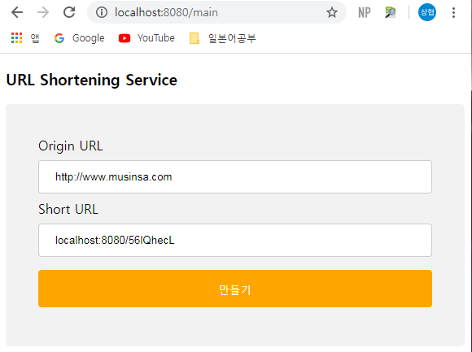
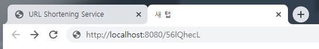
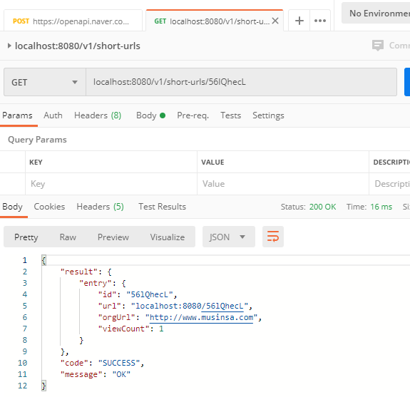

## URL Shortening Service

## Contents
* [Specifications](#chapter-1)
* [Requirement](#chapter-2)
* [Strategy](#chapter-3)
* [Domain](#chapter-4)
* [Explanation of REST](#chapter-5)
* [Api Feature list](#chapter-6)
* [Api Endpoint](#chapter-7)
* [How to run](#chapter-8)
* [How to Test](#chapter-9)


### <a name="chapter-1"></a>Specifications 
````
 OpenJDK15
 Spring Boot 2.3.0.RELEASE
 Spring Data Redis
 Embed Redis 
 Rest API
 Swagger2
 Thymeleaf 
````

### <a name="chapter-2"></a>Requirement 
````
URL을 입력받아 짧게 줄여주고, Shortening된 URL을 입력하면 원래 URL로 리다이렉트하는 URL Shortening Service
예) https://en.wikipedia.org/wiki/URL_shortening => http://localhost/JZfOQNro

- URL 입력폼 제공 및 결과 출력
- URL Shortening Key는 8 Character 이내로 생성되어야 합니다.
- 동일한 URL에 대한 요청은 동일한 Shortening Key로 응답해야 합니다.
- 동일한 URL에 대한 요청 수 정보를 가져야 합니다.
- Shortening된 URL을 요청받으면 원래 URL로 리다이렉트 합니다.
- Unit test 및 Integration test 작성.
````

### <a name="chapter-3"></a>Strategy 
````
Short Url Hash Generate : Naver open api short url
Url form : Thymeleaf template engine
Nosql DB : Embed redis
Redirect : Spring interceptor
````
### <a name="chapter-4"></a>Domain 
```
ShortUrl 
   id(hash) 
   url(short url)
   orgUrl(origin url)
   viewCount(short url view count)
```

### <a name="chapter-5"></a>Explanation of REST 
```
데이터에 액세스하는 표준 방법을 제공하기 위해 API는 REST를 사용합니다.

|-------------|-----------------------------------|
| HTTP Method |  Usage                            |
|-------------|-----------------------------------|
| GET         | Receive a read-only data          |
| PUT         | Overwrite an existing resource    |
| POST        | Creates a new resource            |
| DELETE      | Deletes the given resource        |
|-------------|-----------------------------------|
```


### <a name="chapter-6"></a>Api Feature list 
```
- url을 입력 하여 short url 생성
- hash 값을 입력 받아 origin url, view count 조회
``` 

### <a name="chapter-7"></a>Api Endpoint
```
EndPoint : /v1/short-urls
Method : POST 
Description : short url 생성
Return value: HTTP status 200(OK)  
Payload Example (required parameters)
{
    "url" : "https://www.musinsa.com/" 
}

----------------------------------------------------------------------------------------------------

EndPoint : /v1/short-urls/{hash}
Method : GET
Description : orign url 조회
Return value: HTTP status 200(OK) / 404(NOT_FOUND)

|-----------|--------------|---------------------------------------------------|
| Parameter |Parameter Type| Description                                       |
|-----------|--------------|---------------------------------------------------|
| hash      | @PathParam   | short url hash                                    |
|-----------|--------------|---------------------------------------------------|

```
### <a name="chapter-8"></a>How to Run
```
1. build
./gradlew build

2. run
./gradlew bootrun

3. test 
./gradlew test
./gradlew jacocoTestReport

4. swagger
http://localhost:8080/swagger-ui.html
```

### <a name="chapter-9"></a>How to Test
1. Spring Boot Application을 실행 합니다. 

2.  http://localhost:8080/main 페이지에 접속 합니다.
3. 변환할 url을 입력하고 만들기 버튼을 눌러 short url을 받습니다.


4. 새로운 브라우저를 열어 short url을 입력하고 redirect 된 url을 확인 합니다.




5. localhost:8080/v1/short-urls/{id} 를 입력하여 조회 카운트 증가 여부를 확인 합니다.
